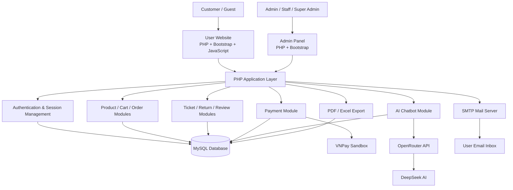
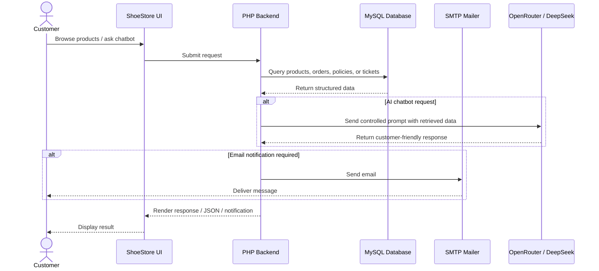
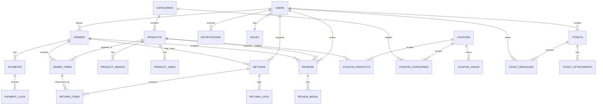

# ShoeStore - AI-Powered Shoe E-Commerce Website 👟


> **Graduation Project:** ShoeStore - Website Bán Giày Tích Hợp Chatbot AI Hỗ Trợ Người Dùng  
> **English title:** ShoeStore - AI-Powered Shoe E-Commerce Website with Customer Support Chatbot

---

## 📌 Table of Contents

- [Logo or Project Banner](#-logo-or-project-banner)
- [Project Overview](#-project-overview)
- [Features](#-features)
  - [User Features](#user-features)
  - [Admin Features](#admin-features)
  - [AI Features](#ai-features)
- [System Architecture](#-system-architecture)
- [Technologies Used](#-technologies-used)
- [Database Design](#-database-design)
- [Folder Structure](#-folder-structure)
- [Installation Guide](#-installation-guide)
  - [Clone Project](#1-clone-project)
  - [Setup XAMPP](#2-setup-xampp)
  - [Setup Database](#3-setup-database)
  - [Configure Environment](#4-configure-environment)
  - [Run Project](#5-run-project)
  - [Run with Ngrok](#6-run-with-ngrok-optional)
- [Screenshots](#-screenshots)
- [API Integration](#-api-integration)
  - [OpenRouter API](#openrouter-api)
  - [DeepSeek](#deepseek)
- [Security Features](#-security-features)
- [Future Development](#-future-development)
- [Author](#-author)

---

## 🖼 Logo or Project Banner

> Replace the placeholder below with the final project banner before publishing screenshots.

```text
┌───────────────────────────────────────────────────────────────┐
│                                                               │
│        ShoeStore - AI-Powered Shoe E-Commerce Website          │
│                                                               │
│        PHP • MySQL • Bootstrap 5 • OpenRouter • DeepSeek       │
│                                                               │
└───────────────────────────────────────────────────────────────┘
```

Recommended banner path:

```text
assets/img/github-banner.png
```

---

## 🚀 Project Overview

**ShoeStore** is a full-featured e-commerce website for selling shoes online. The system is built with **PHP**, **MySQL**, **JavaScript**, **HTML5**, **CSS3**, and **Bootstrap 5**, with an integrated AI chatbot powered by **OpenRouter API** and **DeepSeek AI**.

The project is designed for a graduation thesis and demonstrates a practical online shopping workflow, including product browsing, cart management, checkout, order tracking, customer support tickets, product reviews, return/refund requests, email notifications, invoice export, admin management, and AI-assisted customer consultation.

The system has two main modules:

1. **User Side** - for customers who browse products, place orders, request support, and interact with the AI chatbot.
2. **Admin Side** - for administrators and staff who manage products, orders, inventory, payments, coupons, support tickets, policies, news, and revenue reports.

---

## ✨ Features

### User Features

- 👤 Account registration
- 🔐 Login and logout
- 📧 Forgot password via email
- 🔑 Password reset and password update
- 🧾 Profile management
- 👟 Product listing
- 🔎 Product search
- 🧩 Product filtering by category
- 📄 Product detail page
- 🛒 Shopping cart
- 📦 Order placement
- 💵 Cash on Delivery payment
- 🧪 Mock payment flow for testing
- 🚚 Order status tracking
- ⭐ Product reviews
- 🎫 Support ticket creation
- 🔁 Return, exchange, and refund requests
- 🤖 AI chatbot for product consultation
- 🧾 PDF invoice export
- 📊 Excel data export
- 🔔 Realtime-style notifications and polling

### Admin Features

- 📈 Dashboard statistics
- 👟 Product management
- 🗂 Category management
- 👥 Customer management
- 📦 Order management
- 💳 Payment management
- 🏬 Inventory management
- 🎟 Coupon management
- 🎫 Support ticket management
- ⭐ Product review management
- 📰 News management
- 📜 Policy management
- 🔁 Return/refund request management
- 🧠 Chatbot knowledge base management
- 🧾 Audit log tracking
- 📊 Revenue and payment reports
- 📤 Export reports to PDF and Excel

### AI Features

- 🤖 OpenRouter API integration
- 🧠 DeepSeek AI model support
- 💬 Customer support chatbot
- 👟 Product consultation
- 📦 Product information explanation
- 📜 Shopping policy assistance
- 🔎 Product query before AI response generation
- 🛡 Controlled response behavior to avoid exposing internal database or knowledge base details

---

## 🏗 System Architecture



### Request Flow



---

## 🧰 Technologies Used

### Frontend

| Technology | Purpose |
|---|---|
| HTML5 | Page structure |
| CSS3 | Styling and custom layout |
| Bootstrap 5 | Responsive UI components |
| JavaScript | Dynamic UI interactions, AJAX, polling |
| Font Awesome | Icons |
| Mermaid | System analysis diagrams |
| html2canvas | Export diagrams as PNG |

### Backend

| Technology | Purpose |
|---|---|
| PHP | Server-side application logic |
| PDO | Secure MySQL database access |
| Composer | Dependency management |

### Database

| Technology | Purpose |
|---|---|
| MySQL | Relational database |
| utf8mb4 | Unicode and Vietnamese character support |

### Libraries

| Library | Purpose |
|---|---|
| PHPMailer | SMTP email sending |
| TCPDF | PDF invoice and report generation |
| DomPDF | Alternative PDF rendering library for future PDF templates |
| PhpSpreadsheet | Excel invoice and report export |
| SheetJS | Optional frontend spreadsheet handling if extended |

### Development Environment

| Tool | Purpose |
|---|---|
| XAMPP | Apache, PHP, MySQL local server |
| Visual Studio Code | Source code editor |
| phpMyAdmin | Database import and administration |
| Ngrok | Public tunnel for testing email links and callbacks |

---

## 🗄 Database Design

The system uses a MySQL relational database. Core entities include users, roles, products, categories, product sizes, orders, order items, payments, coupons, tickets, returns, reviews, notifications, policies, news, chatbot knowledge data, audit logs, and password reset tokens.

### Main Tables

| Table | Description |
|---|---|
| `users` | Stores customer, staff, admin, and super admin accounts |
| `roles` | Stores role definitions |
| `categories` | Stores product categories |
| `products` | Stores product information |
| `product_images` | Stores additional product images |
| `product_sizes` | Stores inventory by product size |
| `orders` | Stores order headers |
| `order_items` | Stores products inside each order |
| `payments` | Stores payment transactions |
| `payment_logs` | Stores payment callback and gateway logs |
| `coupons` | Stores discount rules |
| `coupon_products` | Stores coupon-product scope |
| `coupon_categories` | Stores coupon-category scope |
| `coupon_usage` | Stores coupon usage history |
| `reviews` | Stores product reviews |
| `review_media` | Stores review images or videos |
| `tickets` | Stores support tickets |
| `ticket_messages` | Stores ticket conversation messages |
| `ticket_attachments` | Stores ticket files |
| `returns` | Stores return, exchange, and refund requests |
| `return_items` | Stores products related to return requests |
| `return_logs` | Stores approval and rejection history |
| `notifications` | Stores user and admin notifications |
| `policies` | Stores shopping, warranty, return, and privacy policies |
| `news` | Stores news articles |
| `popups` | Stores promotional popups |
| `chatbot_kb` | Stores chatbot knowledge entries |
| `audit_logs` | Stores important system actions |
| `password_resets` | Stores password reset token hashes |

### ERD



---

## 📁 Folder Structure

```text
shoestore/
├── admin/
│   ├── auditlogs/
│   ├── chatbot-kb/
│   ├── coupons/
│   ├── customers/
│   ├── dashboard.php
│   ├── fraud/
│   ├── inventory/
│   ├── news/
│   ├── notifications.php
│   ├── orders/
│   ├── payments/
│   ├── policies/
│   ├── popupads/
│   ├── products/
│   ├── returns/
│   ├── reviews/
│   ├── support/
│   └── tools/
├── api/
│   ├── chatbot.php
│   ├── coupon.php
│   ├── inventory.php
│   ├── notifications/
│   ├── orders/
│   ├── search.php
│   ├── tickets/
│   └── vnpay.php
├── assets/
│   ├── css/
│   ├── img/
│   └── js/
├── auth/
│   ├── forgot-password.php
│   ├── login.php
│   ├── logout.php
│   ├── register.php
│   ├── reset-password.php
│   └── verify-email.php
├── config/
│   ├── app.php
│   ├── database.php
│   ├── mail.php
│   ├── momo.php
│   ├── openrouter.php
│   └── vnpay.php
├── database/
│   ├── shoestore.sql
│   └── seed_*.php / seed_*.sql
├── includes/
│   ├── bootstrap.php
│   ├── layout.php
│   ├── mailer.php
│   ├── order-ui.php
│   ├── product-card.php
│   └── support-system.php
├── invoice/
│   ├── generate-excel.php
│   └── generate-pdf.php
├── payments/
│   ├── mock_gateway.php
│   └── mock_return.php
├── templates/
│   └── email/
├── uploads/
├── user/
│   ├── notifications.php
│   ├── order-detail.php
│   ├── orders.php
│   ├── profile.php
│   ├── returns.php
│   ├── reviews.php
│   └── tickets/
├── cart.php
├── checkout.php
├── index.php
├── product.php
├── products.php
├── policies.php
├── news.php
├── test-mail.php
├── test-openrouter.php
├── testcase.php
├── usecase.php
├── composer.json
└── README.md
```

---

## ⚙ Installation Guide

### 1. Clone Project

```bash
git clone https://github.com/your-username/shoestore.git
```

Move into the project folder:

```bash
cd shoestore
```

If you use XAMPP, place the project in:

```text
C:/xampp/htdocs/shoestore
```

or:

```text
D:/xampp/htdocs/shoestore
```

### 2. Setup XAMPP

1. Open **XAMPP Control Panel**.
2. Start **Apache**.
3. Start **MySQL**.
4. Open phpMyAdmin:

```text
http://localhost/phpmyadmin
```

### 3. Setup Database

Create a new database:

```sql
CREATE DATABASE shoestore
CHARACTER SET utf8mb4
COLLATE utf8mb4_unicode_ci;
```

Import the SQL file:

```text
database/shoestore.sql
```

Optional seed files can be executed when additional demo data is required:

```text
database/seed_more_products.sql
database/seed_reviews.php
database/seed_news_long.php
```

### 4. Configure Environment

#### Database

Open:

```text
config/database.php
```

Default XAMPP configuration:

```php
const DB_HOST = '127.0.0.1';
const DB_NAME = 'shoestore';
const DB_USER = 'root';
const DB_PASS = '';
const DB_CHARSET = 'utf8mb4';
```

#### Application URL

Open:

```text
config/app.php
```

Local configuration:

```php
define('USE_NGROK', false);
define('LOCAL_HOST', 'http://localhost');
define('LOCAL_SUBDIR', '/shoestore');
```

#### SMTP Mail

Open:

```text
config/mail.php
```

For Gmail SMTP, use an **App Password**, not your normal Gmail password:

```php
define('MAIL_HOST', 'smtp.gmail.com');
define('MAIL_PORT', 587);
define('MAIL_SECURE', 'tls');
define('MAIL_USERNAME', 'your-email@gmail.com');
define('MAIL_PASSWORD', 'your-google-app-password');
define('MAIL_FROM_EMAIL', 'your-email@gmail.com');
define('MAIL_FROM_NAME', 'ShoeStore');
```

Test email sending:

```text
http://localhost/shoestore/test-mail.php
```

#### OpenRouter API

Open:

```text
config/openrouter.php
```

Configure your API key and model:

```php
define('OPENROUTER_API_KEY', 'your-openrouter-api-key');
define('OPENROUTER_MODEL', 'deepseek/deepseek-chat');
```

Test AI connection:

```text
http://localhost/shoestore/test-openrouter.php
```

#### Composer Dependencies

Install PHP dependencies:

```bash
composer install
```

### 5. Run Project

Open the website:

```text
http://localhost/shoestore
```

Common pages:

```text
http://localhost/shoestore/products.php
http://localhost/shoestore/cart.php
http://localhost/shoestore/auth/login.php
http://localhost/shoestore/admin/dashboard.php
http://localhost/shoestore/usecase.php
http://localhost/shoestore/testcase.php
```

### 6. Run with Ngrok (Optional)

Ngrok is useful for testing email reset links, payment callbacks, and public access.

1. Start XAMPP Apache and MySQL.
2. Run ngrok:

```bash
ngrok http 80
```

3. Copy the forwarding URL, for example:

```text
https://xxxx.ngrok-free.app
```

4. Open:

```text
config/app.php
```

5. Update:

```php
define('USE_NGROK', true);
define('NGROK_HOST', 'https://xxxx.ngrok-free.app');
define('NGROK_SUBDIR', '/shoestore');
```

6. Open the public URL:

```text
https://xxxx.ngrok-free.app/shoestore
```

> Note: Free ngrok URLs change after restarting ngrok. Update `NGROK_HOST` whenever the forwarding URL changes.

---

## 🖼 Screenshots

> Add real screenshots before submitting or publishing the repository.

### Home Page

```text
docs/screenshots/home-page.png
```

### Product Listing

```text
docs/screenshots/product-listing.png
```

### Product Detail

```text
docs/screenshots/product-detail.png
```

### Cart and Checkout

```text
docs/screenshots/cart-checkout.png
```

### AI Chatbot

```text
docs/screenshots/ai-chatbot.png
```

### User Orders

```text
docs/screenshots/user-orders.png
```

### Admin Dashboard

```text
docs/screenshots/admin-dashboard.png
```

### Admin Product Management

```text
docs/screenshots/admin-products.png
```

### Support Tickets

```text
docs/screenshots/support-tickets.png
```

---

## 🔌 API Integration

### OpenRouter API

OpenRouter is used as the AI gateway for chatbot responses. The chatbot workflow is designed to query internal product or policy data first, then send controlled context to the AI model.

Main responsibilities:

- Send AI prompts to OpenRouter
- Use DeepSeek model for response generation
- Generate natural customer support replies
- Assist product consultation
- Avoid exposing implementation details, database names, or internal knowledge base structure

Configuration file:

```text
config/openrouter.php
```

Example configuration:

```php
define('OPENROUTER_API_KEY', 'your-openrouter-api-key');
define('OPENROUTER_MODEL', 'deepseek/deepseek-chat');
```

### DeepSeek

DeepSeek is used as the AI model behind the chatbot. It helps generate customer-friendly responses for:

- Product recommendation
- Product information explanation
- Shopping policy questions
- Warranty policy questions
- Delivery questions
- Size recommendation guidance

Important behavior:

- Product-related questions should query available products first.
- The AI must not invent product price, stock, promotion, or warranty data.
- The AI should respond like a professional sales consultant.
- The chatbot must not expose database, internal system, or knowledge base details.

---

## 🔐 Security Features

- 🔒 **Password Hashing**  
  User passwords are stored using secure password hashing instead of plain text.

- 🧑‍💻 **Session Management**  
  Login sessions are managed server-side with PHP sessions.

- 🛂 **Role Based Access Control**  
  Admin pages are protected by role checks for admin, staff, and super admin workflows.

- ✅ **Input Validation**  
  Forms validate required fields, password rules, order status rules, and user-submitted data.

- 🧼 **Output Escaping**  
  User-facing values should be escaped before rendering to reduce XSS risk.

- 🗄 **PDO Prepared Statements**  
  Database operations use PDO patterns to reduce SQL injection risk.

- 📧 **Secure Password Reset Flow**  
  Password reset tokens are randomly generated, hashed before storage, time-limited, and invalidated after use.

- 🧾 **Audit Logging**  
  Important admin and user actions can be recorded for traceability.

- 🌐 **UTF-8 Database Connection**  
  MySQL connection uses `utf8mb4` and `utf8mb4_unicode_ci` for safe Vietnamese text handling.

---

## 🧭 Future Development

- Online payment gateway production mode
- Advanced recommendation engine
- Product comparison feature
- Wishlist feature
- Multi-language support
- Advanced promotion campaign management
- Shipping provider integration
- Admin activity analytics
- AI-powered product tagging
- AI-powered order support assistant
- Progressive Web App support
- Unit and integration test suite
- Docker-based deployment environment

---

## 👨‍💻 Author

| Field | Information |
|---|---|
| nickname | **dohungclgt** |
| Major | **Software Engineering (not really)** |
| Year | **2026** |

---

## 📚 Academic Purpose

This project was developed as a graduation project to demonstrate practical skills in web application development, database design, e-commerce workflows, payment integration, email automation, report exporting, admin management, and AI chatbot integration.

---

## ⭐ Project Status

```text
Status: Graduation Project
Version: 1.0.0
Environment: XAMPP / Local Development
```

If this project is useful for learning or reference, consider giving it a star on GitHub.
